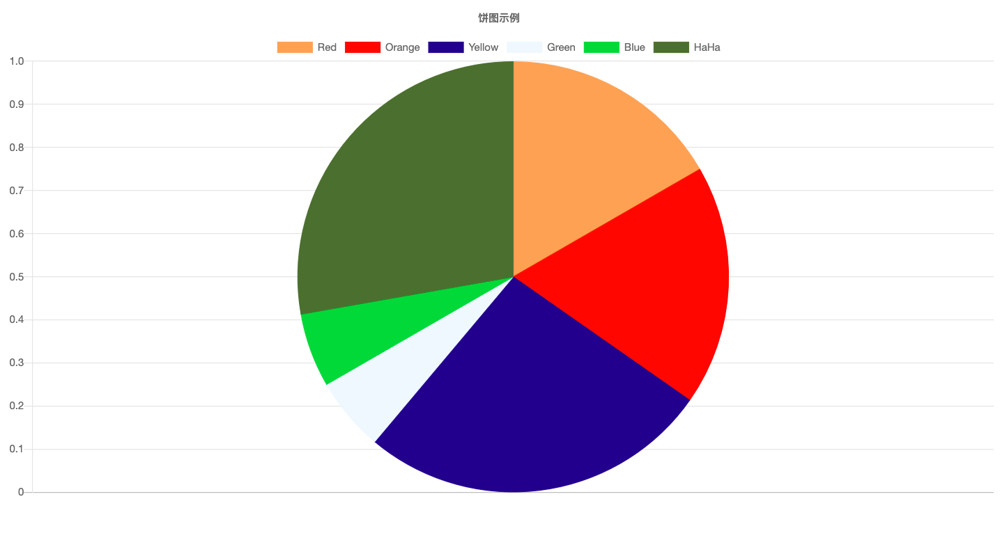

# GoCharts

> Go 结合 Chart.js 开发的一个图表库

## 示例

---
@Author: 谢伟

@WeChat: wu_xiaoshen

@ZhiHu: [谢伟](https://www.zhihu.com/people/wu-xiao-shen-16/activities)

@BiliBili:[Wuxiaoshen](https://space.bilibili.com/10056291)

